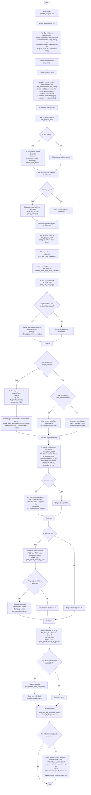

```mermaid
flowchart TD
  A([Start]) --> B["Run python growth_analyses.py"]
  B --> C["growth_analyses.py: cli()"]
  C --> C1["Key CLI switches:\n--age-strategy {mixed_effects|first_measurement}\n--skip-zoo-overall | --skip-zoo-by-sex\n--skip-wild-overall | --skip-wild-by-sex\n--outputs-dir PATH | --graphs-dir PATH"]
  C1 --> D["Parse command-line arguments"]
  D --> E["Create AnalysisConfig"]
  E --> E1["Set birth_height_mode + measurement set\n(get_measurements_for_config)\nModel candidates: gompertz, logistic, von_bertalanffy, richards, poly3, poly4\nConstraint mode: fixed_y0 | constrained | unconstrained"]
  E1 --> F["pipeline.py: main(config)"]

  F --> G["Load zoo data (data.py: load_prepare_zoo)"]

  G --> H{"fit_zoo_overall?"}
  H -- "Yes" --> H1["Fit zoo juvenile height (overall)\n(fitting.py: fit_growth_models; models.py: select_best_model)"]
  H -- "No" --> H2["Skip zoo overall juvenile fit"]
  H1 --> I["Record diagnostics + print fit summary"]
  H2 --> I

  I --> J{"fit_zoo_by_sex?"}
  J -- "Yes" --> J1["Fit zoo juvenile height by sex (M/F)\n(fit_growth_models group_col=Sex)"]
  J -- "No" --> J2["Skip zoo sex-specific juvenile fit"]
  J1 --> K["Record diagnostics + print fit summary"]
  J2 --> K

  K --> L["Load wild data (data.py: load_prepare_wild)\nCompute TH and clean fields"]
  L --> M["Map age classes to midpoints (add_age_class_midpoints)"]
  M --> N["Assign initial age_months from first sighting\n(assign_initial_ages_from_classes)"]
  N --> O["Create umbilicus flag VTB_Umb_Flag (add_vtb_umb_flag)"]

  O --> P{"Any successful zoo juvenile fit available?"}
  P -- "Yes" --> P1["Refine wild ages using zoo juvenile curves\n(age.py: refine_ages_with_zoo_models)"]
  P -- "No" --> P2["Skip zoo-based age refinement"]
  P1 --> Q["Continue"]
  P2 --> Q

  Q --> R{"age_strategy == mixed_effects?"}
  R -- "Yes" --> R1["Fit TH alignment seed curves (wild)\n- overall\n- by sex\n(fit_growth_models; selected by AIC)"]
  R1 --> R2["Refine ages per individual by alignment\n(age.py: refine_ages_with_individual_alignment)\nObjective = SSE + penalty*(age0-seed)^2"]
  R -- "No" --> R3{"age_strategy == first_measurement?"}
  R3 -- "Yes" --> R4["Keep current ages from earlier steps\n(first-measurement style)"]
  R3 -- "No" --> R5["Unknown age strategy\nWarn + fall back to first-measurement behavior"]
  R2 --> S["Proceed to growth fitting"]
  R4 --> S
  R5 --> S

  S --> S0["fit_growth_models calls models.py: select_best_model\nAIC-ranked across chosen candidates; prefer Gompertz if within 1% AIC\nBirth-height mode sets whether y0 is fixed, bounded, or free"]
  S0 --> T{"fit_wild_overall?"}
  T -- "Yes" --> T1["For each measurement in MEASUREMENTS:\nFit overall curve + report + plot\n(plotting.py: plot_growth_curve_overall)"]
  T -- "No" --> T2["Skip wild overall fits"]
  T1 --> U["Continue"]
  T2 --> U

  U --> V{"fit_wild_by_sex?"}
  V -- "Yes" --> V1["For each measurement:\nFit by sex (M/F) using known-sex subset\nReport + plot (plot_growth_curve_by_sex)"]
  V -- "No" --> V5["Skip wild sex-specific fits"]
  V1 --> V2{"Any records with Sex unknown?"}
  V2 -- "Yes" --> V3["Optionally fit pooled unknown-sex subset\n(if enough points)\nReport + plot (overall)"]
  V2 -- "No" --> V4["No unknown-sex subset fit"]
  V3 --> W["Continue"]
  V4 --> W["Continue"]
  V5 --> W

  W --> X["Always attempt: fit TH by VTB_Umb_Flag (Umb=0 vs Umb>0)\nmin_points=5\nReport + plot (plot_growth_curve_by_group)"]
  X --> Y{"Any TH-by-umbilicus fit succeeded?"}
  Y -- "Yes" --> Y1["Save group plot\n(plot_growth_curve_by_group)"]
  Y1 --> Y2["Save per-individual trajectories for Umb>0"]
  Y -- "No" --> Y3["Skip Umb plots"]

  Y2 --> Z["Write Outputs:\n- wild_with_age_estimates_*.csv\n- model_fit_diagnostics.csv"]
  Y3 --> Z
  Z --> AB{"Run indeterminate growth analysis?"}
  AB -- "Yes" --> AB1["check_indeterminate_growth.py\nUse Data/zoo.csv + wild_with_age_estimates_*\nAdults >= 10y: fit linear slope by sex\nOutputs: indeterminate_growth_results.csv + indeterminate_growth_report.md"]
  AB -- "No" --> AA([End])
  AB1 --> AA

```
